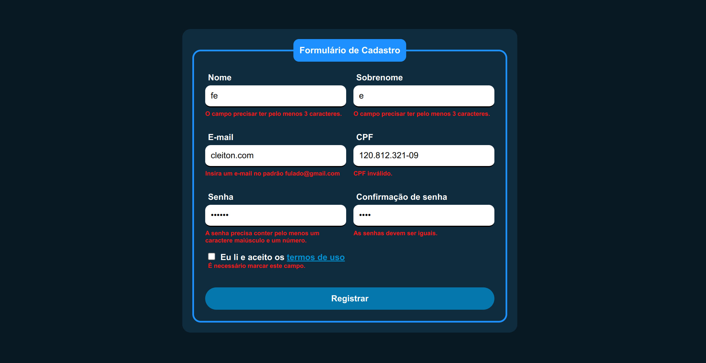

<h1 align="center"> Registration Form </h1>

	<a href="#about">Resumo</a> |
	<a href="#preview">Preview</a> |
	<a href="#technologies">Tecnologias </a> |
	<a href="#author">Autor</a> 

<h2 id="about"> Resumo </h2>

Um simples formulário de cadastro que fiz visando treinar/brincar com validações de dados via JS.

<h2 id="preview"> Preview </h2>

	

<h2 id="technologies"> Tecnologias </h2>

Este projeto foi desenvolvido com as seguintes tecnologias: 

✔️ HTML

✔️ CSS

✔️ JavaScript

<h2 id="author"> Autor </h2>

<b>👤 Riquelme Damião Silva<b>

	
    	
	

